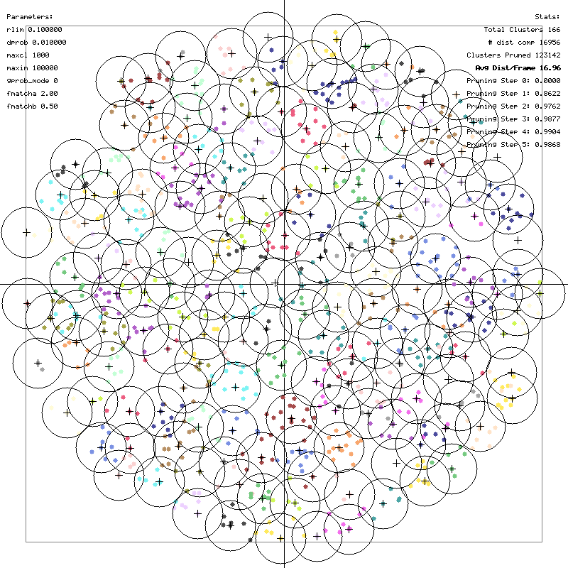
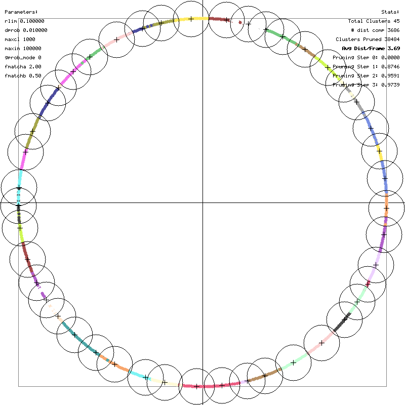
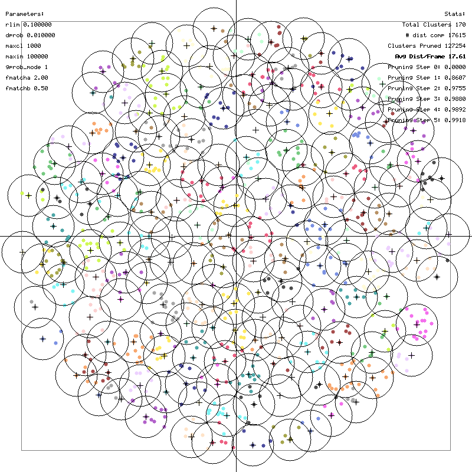
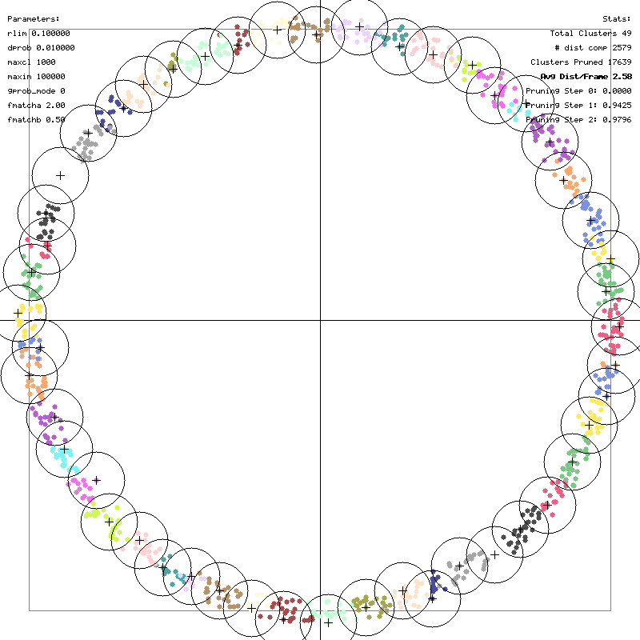

# Benchmarks

This page documents the performance of the `image_cluster` tool.

## Test Environment
- **Data**: Synthetic 128-dimensional sequences generated via `image-cluster-mktxtseq`.
- **Compiler**: GCC/Clang with `-O3 -march=native -funroll-loops` (AVX2 enabled).

## 1. Slow Moving Point on 2D Spiral

**Description**:
A point moving slowly along a spiral trajectory. This tests the algorithm's "short-term memory". Since the point moves slowly, it stays within the same cluster or a neighboring cluster for multiple frames. The algorithm's probability ranking (`prob`) ensures the most recently matched clusters are checked first.

**Command**:
```bash
./image-cluster 0.1 bench_spiral_slow.txt
```

**Result**:

*   **Time**: ~25 ms
*   **Calls**: ~17k (for 1000 frames)

## 2. Random Point on 2D Circle

**Description**:
Points appearing randomly on a unit circle. This demonstrates geometric solving. Since the manifold is 1D (circle) embedded in 2D, the triangle inequality allows efficient pruning. With `rlim=0.1` and unit radius, there are ~60 clusters. For any new point, usually 2 anchor clusters are close enough to "triangulate" the position or prune the rest.

**Command**:
```bash
./image-cluster 0.1 bench_circle_rand.txt
```

**Result**:

*   **Time**: ~6 ms
*   **Calls**: ~3.7k (~3.7 calls per frame). This validates the expectation that after finding 1-2 close clusters, the rest are pruned efficiently.

## 3. Random Points on 2D Spiral (`-gprob`)

**Description**:
Points appearing randomly on a spiral. Unlike the circle, the spiral has complex local geometry. Using `-gprob` allows the algorithm to learn the geometric relationships (neighbors in signal space) even if they are not neighbors in time.

**Command**:
```bash
./image-cluster 0.1 bench_spiral_rand.txt -gprob
```

**Result**:

*   **Time**: ~16 ms
*   **Calls**: ~17k.

## 4. Recurring Sequence (`-tm`)

**Description**:
A pattern (circle traversal) that repeats 10 times with noise (`0.04`). This creates a recurring sequence of clusters. The Transition Matrix (`-tm`) option learns these transitions.

**Command**:
```bash
./image-cluster 0.1 bench_recurring.txt -tm 1.0
```

**Result**:

*   **Time**: ~8 ms
*   **Calls**: ~2.6k. Ideally, if the sequence is perfectly predicted, calls per frame approaches 1 (just verifying the predicted cluster). Here it's ~2.6, showing strong predictive performance.

---

## High-Dimensional Benchmarks

### Scenario 1: Random Walk (1000 frames, 128D)

**Dataset**:
- 1000 frames, 128 dimensions.
- Random walk pattern (highly correlated).
- `rlim=0.5`.

**Results**:

| Mode | Total Time (ms) | Dist Calls | Notes |
|------|-----------------|------------|-------|
| Standard | ~39 ms | 1,846 | Baseline performance. |
| Transition Matrix (`-tm 1.0`) | ~38 ms | 1,832 | Slight reduction in calls by using history. |
| Geometric Prob (`-gprob`) | ~37 ms | 1,846 | Efficient candidate ranking. |

### Scenario 2: Uniform Random (1000 frames, 128D)

**Dataset**:
- 1000 frames, 128 dimensions.
- Uniform random distribution (uncorrelated, "hard" clustering).
- `rlim=2.5`.

**Results**:

| Mode | Total Time (ms) | Dist Calls | Notes |
|------|-----------------|------------|-------|
| Standard (Triangle Ineq) | ~756 ms | 985,683 | Fast metric evaluation (AVX2) dominates. |
| 4-Point Pruning (`-te4`) | ~11,811 ms | 605,013 | Reduced calls by ~40%, but high logic overhead. |
| 5-Point Pruning (`-te5`) | ~98,744 ms | 559,962 | Reduced calls by ~45%, but very high logic overhead. |
